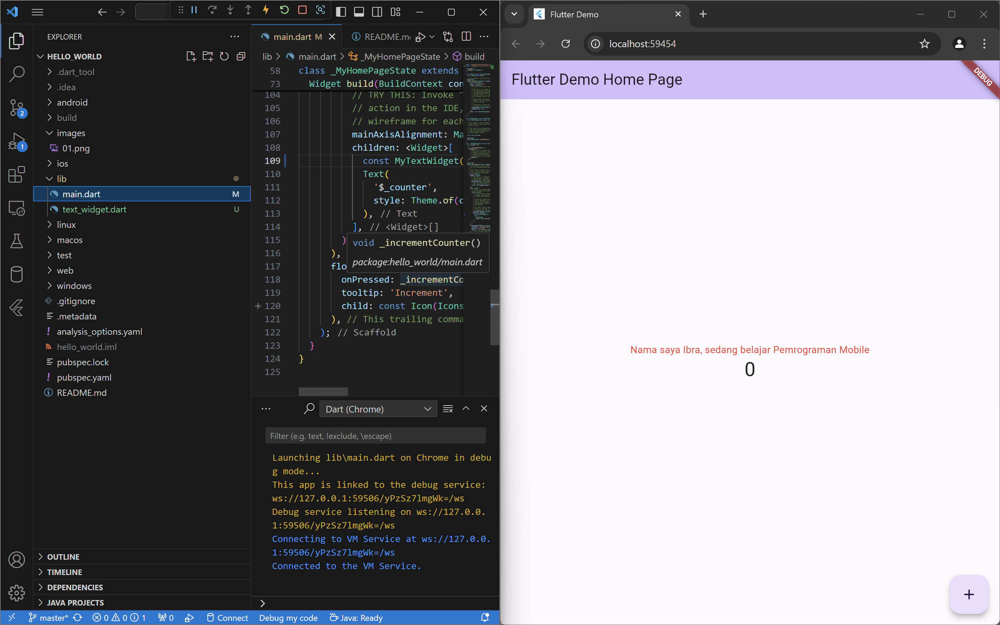
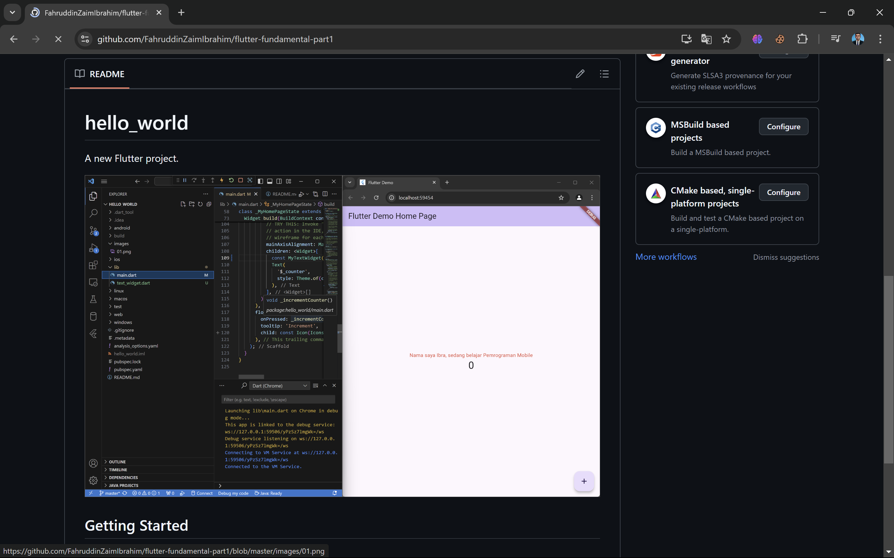

# hello_world

A new Flutter project.

## Getting Started

This project is a starting point for a Flutter application.

A few resources to get you started if this is your first Flutter project:

- [Lab: Write your first Flutter app](https://docs.flutter.dev/get-started/codelab)
- [Cookbook: Useful Flutter samples](https://docs.flutter.dev/cookbook)

For help getting started with Flutter development, view the
[online documentation](https://docs.flutter.dev/), which offers tutorials,
samples, guidance on mobile development, and a full API reference.

Praktikum 1

Project baru telah dibuat  

Praltikum 2

Kita bisa menyambungkan VSCODE ke Handphone melalui 2 cara yaitu menggunakan kabel dan wireless.
Jika wireless maka kita harus menggunakan WIFI yang sama. 

Praktikum 3

Menambahkan SS di readme dengan mengganti tulisan menjadi nama sendiri melalui text widget

Praktikum 4

Mengganti text widget menjadi gambar 

Praktikum 5

Langkah 1:

Cuppertino button adalah tulisan yang bisa di klik dan tersambung ke link yang telah disambungkan

Langkah 2:

Button widget terdapat beberapa macam pada flutter yaitu ButtonBar, DropdownButton, TextButton, FloatingActionButton, IconButton, OutlineButton, PopupMenuButton, dan ElevatedButton.

Langkah 3:

Scaffold widget digunakan untuk mengatur tata letak sesuai dengan material design.

Langkah 4:

Dialog widget pada flutter memiliki dua jenis dialog yaitu AlertDialog dan SimpleDialog

Langkah 5:

Flutter menyediakan widget yang dapat menerima input dari pengguna aplikasi yaitu antara lain Checkbox, Date and Time Pickers, Radio Button, Slider, Switch, TextField.

Langkah 6:

Date and Time Pickers termasuk pada kategori input dan selection widget